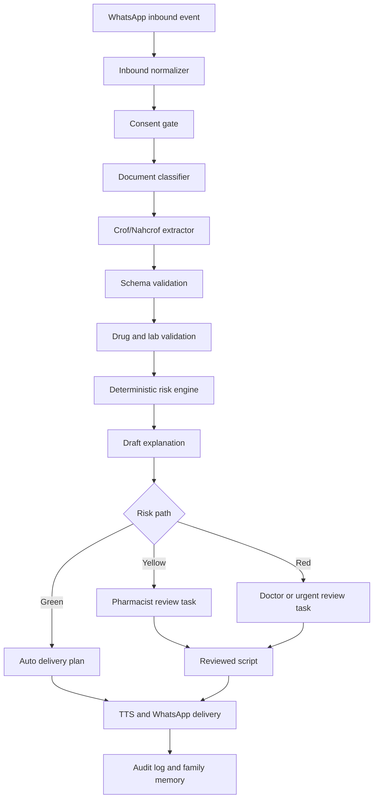

# Architecture Notes

The pipeline should stay modular. Provider-specific code belongs at the edges: extraction providers, TTS providers, WhatsApp providers, database adapter, and object storage adapter.

