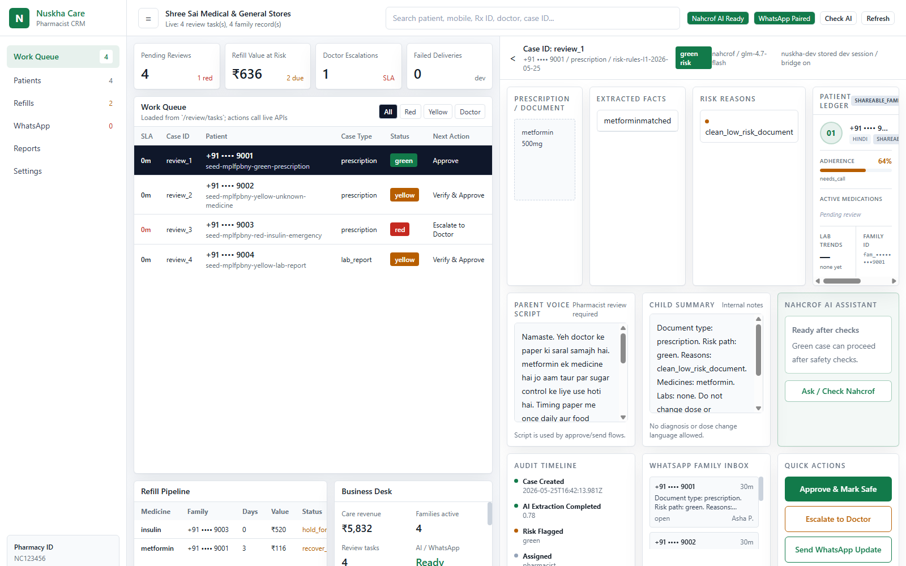

# Nuskha Care

WhatsApp-first medical document explanation for Indian families and neighborhood pharmacists.

Nuskha Care helps a family understand what is written on a prescription, lab report, or medicine label. It reads the document, validates what it can, routes risk through deterministic rules, and prepares a simple parent-language explanation for human review.

It is not a doctor, not a diagnosis engine, not a medicine marketplace, and not ready for unsupervised real patient use.

## Current Status

This repository is a public L1 implementation across the planned GSD phases. It contains working local APIs, synthetic fixtures, provider seams, a pharmacist CRM, and pilot-readiness controls.



| Area | Status |
|---|---|
| Core intake and consent | implemented-l1 |
| Structured extraction path | implemented-l1 |
| Drug/lab validation | implemented-l1 |
| Rule-based risk routing | implemented-l1 |
| Pharmacist/doctor review APIs | implemented-l1 |
| Voice and delivery seams | implemented-l1 |
| Pharmacist CRM | implemented-l1 |
| Pharmacy care desk layer | implemented-l1 |
| Pilot readiness controls | implemented-l1 |
| Production WABA, auth, real storage | not production-ready |

## Core Product

The first product is:

> Safe prescription and lab-report explanation plus refill recovery and WhatsApp family CRM for pharmacists.

The workflow:

1. Parent or caregiver sends a document on WhatsApp.
2. Nuskha classifies it as prescription, lab report, medicine label, or unsupported.
3. AI extracts structured facts.
4. Validators check medicines, lab values, and confidence.
5. A deterministic risk engine routes green, yellow, or red.
6. AI drafts a parent script and child summary from validated facts only.
7. Pharmacist or doctor reviews uncertain or risky cases.
8. The family receives a safe explanation, not a diagnosis.

## What It Can Explain

For prescriptions:

- Medicine name, when confidently identified.
- Common use in simple words.
- Timing exactly as written or marked unclear.
- Warning signs to watch.
- Questions to ask the doctor.
- Reminder to not change dose without the doctor.

For lab reports:

- Values marked high, low, normal, or critical.
- The body area the test usually relates to.
- Red-flag symptoms that need urgent care.
- Reminder to discuss interpretation with the treating doctor.

## Safety Boundaries

Nuskha Care must not:

- diagnose disease,
- change, stop, or start a dose,
- recommend cheaper substitutes,
- say a number is safe or no worry,
- bypass human review during pilot mode,
- use Baileys for production patient workflows,
- store unrelated WhatsApp chit-chat as medical history,
- commit real patient records or secrets.

## Quickstart

Requirements:

- Node.js 22 or newer
- npm

Install and verify:

```bash
npm install
npm test
npm run check
npm run fixtures
```

Start the API and CRM:

```bash
npm run dev:crm
```

Open:

```text
http://localhost:8787/crm
```

Seed local synthetic cases:

```bash
curl -X POST http://localhost:8787/dev/seed-fixtures -H "content-type: application/json" -d "{}"
```

## Environment

Copy `.env.example` to `.env` for local use.

Important local settings:

```text
PORT=8787
NUSKHA_DEFAULT_LANGUAGE=hi
NUSKHA_PILOT_MODE=true
NUSKHA_AI_PROVIDER=stub
NUSKHA_DELIVERY_PROVIDER=stub
NUSKHA_TTS_PROVIDER=stub
```

For Nahcrof/Crof-compatible extraction health checks:

```text
NUSKHA_AI_PROVIDER=nahcrof
OPENAI_BASE_URL=...
OPENAI_API_KEY=...
OPENAI_MODEL=...
```

Do not commit `.env`, runtime folders, patient files, WhatsApp auth state, or real medical documents.

## Useful Endpoints

| Endpoint | Purpose |
|---|---|
| `GET /health` | API and AI provider status |
| `GET /crm` | Pharmacist CRM |
| `GET /crm/ops` | Pharmacy OS layer: refills, inbox, portal, orders, inventory, adherence, staff SLA |
| `POST /dev/seed-fixtures` | Create synthetic demo cases through the real pipeline |
| `POST /dev/whatsapp-inbound` | Local WhatsApp-style inbound webhook |
| `GET /review/tasks` | List review tasks |
| `GET /review/tasks/:id` | Inspect a review task |
| `POST /review/tasks/:id/edit` | Edit parent script or child summary |
| `POST /review/tasks/:id/approve` | Approve and create delivery plan |
| `POST /review/tasks/:id/escalate` | Escalate to doctor queue |
| `GET /pilot/readiness` | Pilot readiness checklist |
| `GET /pilot/waba-templates` | WABA utility template pack |
| `GET /pilot/consent-copy` | Hindi and English consent text |
| `POST /privacy/erasure-requests` | Record an operator-handled erasure request |
| `GET /integrations/status` | AI and Baileys dev transport status |

## WhatsApp Development Transport

Baileys is included only for internal development before WABA approval.

Login:

```bash
npm run dev:baileys:login -- nuskha-dev --stay-alive
```

Run bridge:

```bash
npm run dev:baileys:bridge -- nuskha-dev
```

Production must use WhatsApp Business API through an approved provider.

## AI Voice Roadmap

Nuskha already has a TTS seam in `src/tts/tts-service.mjs`, plus environment slots for Sarvam and Bhashini. The next voice milestone should borrow the working shape from the local `voice-local-mvp` project: provider abstraction, speech-specific text cleanup before synthesis, caching, latency measurement, and round-trip quality checks.

| Step | Goal | Implementation direction |
|---|---|---|
| 1. Real provider adapter | Replace stub voice files with real audio | Implement `sarvam` first, keep `bhashini` as India-language fallback, preserve the current `synthesizeVoice({ script, language })` interface |
| 2. Spoken-script cleanup | Make voice notes sound human and short | Add a speech-delivery rule layer before TTS so parent scripts become shorter, less formal, and easier to understand when spoken |
| 3. WhatsApp audio format | Send native voice-note compatible media | Produce OGG/Opus artifacts, store them privately, and pass media URLs to the WABA delivery adapter |
| 4. Voice cache | Cut cost and latency | Cache common safety phrases and repeated explanations by language, provider, voice, and script hash |
| 5. Quality checks | Prevent bad or unsafe audio | Re-transcribe generated voice in test mode and compare it against the approved script for meaning drift, missing safety warnings, and pronunciation issues |
| 6. Observability | Know if voice is usable | Track TTS latency, provider failure rate, cache hit rate, audio duration, and WhatsApp delivery status |
| 7. Language rollout | Expand safely beyond Hindi | Ship Hindi first, then Marathi, Tamil, Bengali, and Gujarati only after pharmacist review confirms quality |

Voice must remain downstream of human review in pilot mode. The system may generate audio only from the approved parent script, never directly from raw model output.

## Architecture

```text
WhatsApp / dev webhook
        |
Fastify API
        |
Classifier
        |
Structured extraction
        |
Zod schema validation
        |
Drug and lab validators
        |
Deterministic risk engine
        |
Green / Yellow / Red routing
        |
Auto delivery seam / Pharmacist queue / Doctor queue
        |
TTS + delivery adapter
        |
Audit, review tasks, family memory
```

Key implementation areas:

- `src/core/pipeline.mjs` - intake, consent, extraction, validation, risk, routing.
- `src/core/risk-engine.mjs` - deterministic green/yellow/red rules.
- `src/core/review-service.mjs` - review edit, approve, escalate.
- `src/core/pharmacy-os.mjs` - pharmacy care desk summary layer.
- `src/core/pilot-readiness.mjs` - pilot templates, consent, readiness, erasure.
- `src/store/*` - memory and Neon-shaped store adapters.
- `frontend/pharmacist-crm.html` - API-backed pharmacist CRM.
- `experimental/baileys-transport/*` - internal WhatsApp dev bridge.

## GSD Phase Status

| Phase | Status | Output |
|---|---|---|
| 1 Durable Core | implemented-l1 | Neon schema, storage seam, duplicate guard, fixtures |
| 2 Crof Extraction | implemented-l1 | Crof/Nahcrof adapter path, validation, fallback routing |
| 3 Review Workflow | implemented-l1 | Review APIs, edits, approval, escalation |
| 4 Voice Delivery | implemented-l1 | TTS artifacts, Baileys dev delivery, WABA seam |
| 5 Pharmacist CRM | implemented-l1 | Management-accountant style CRM and pharmacy OS surface |
| 6 Pilot Readiness | implemented-l1 | WABA templates, consent, erasure, monitoring, runbooks |

## Production Gaps

Before any real pilot:

- Verify Neon migrations against a real database.
- Replace local object storage stubs with private S3-compatible storage.
- Add authentication and role-based access control.
- Submit and approve WABA templates.
- Implement production WABA delivery.
- Connect real Sarvam/Bhashini TTS output, OGG/Opus conversion, voice caching, and audio quality checks.
- Complete clinical advisor signoff for rule packs and lab thresholds.
- Run only founder/operator-supervised cases with `NUSKHA_PILOT_MODE=true`.

## Verification

Current public snapshot verification:

```bash
npm test
npm run check
npm run fixtures
```

Expected baseline:

- 20 tests passing.
- Static syntax checks passing.
- Synthetic fixtures for green, yellow, red, lab, and unsupported cases passing.

## Documents

- [Public Release Snapshot](./docs/PUBLIC_RELEASE.md)
- [Business Case](./BUSINESS_CASE.md)
- [Product Definition](./PRODUCT.md)
- [Core Algorithm](./CORE_ALGORITHM.md)
- [Technical Structure](./docs/TECHNICAL_STRUCTURE.md)
- [L1 Core Product Steps](./docs/L1_CORE_PRODUCT_STEPS.md)
- [Pilot Readiness](./docs/PILOT_READINESS.md)
- [Open Source Boundary](./docs/OPEN_SOURCE_BOUNDARY.md)
- [Competitor Gap Analysis](./docs/COMPETITOR_GAP_ANALYSIS.md)
- [GSD Phase Index](./.planning/PHASES.md)

## License

See [LICENSE](./LICENSE).
